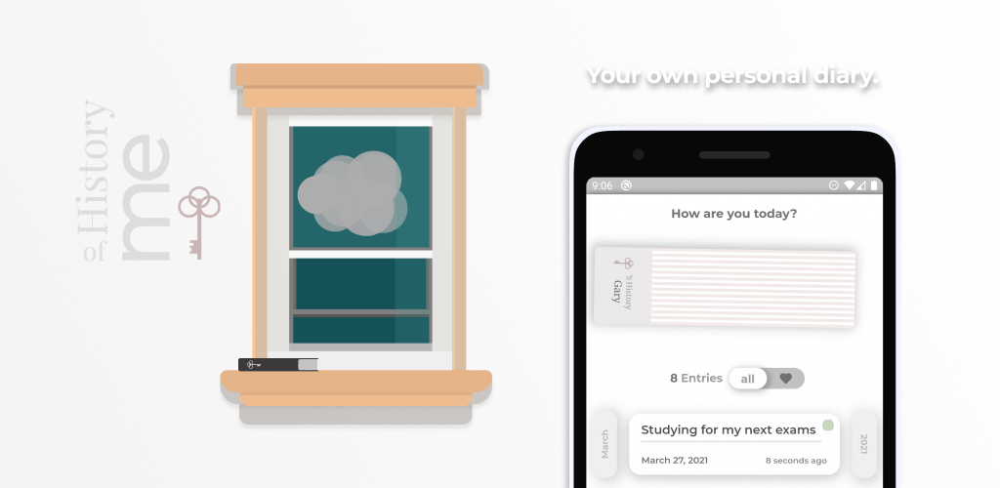
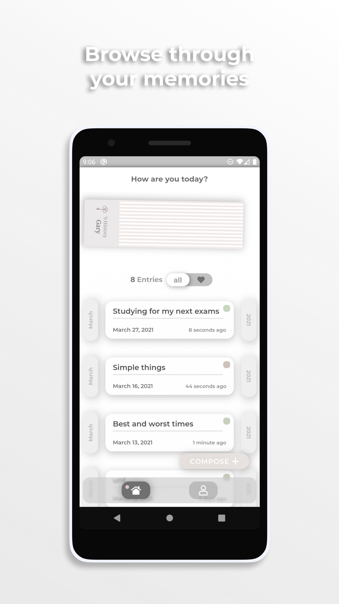
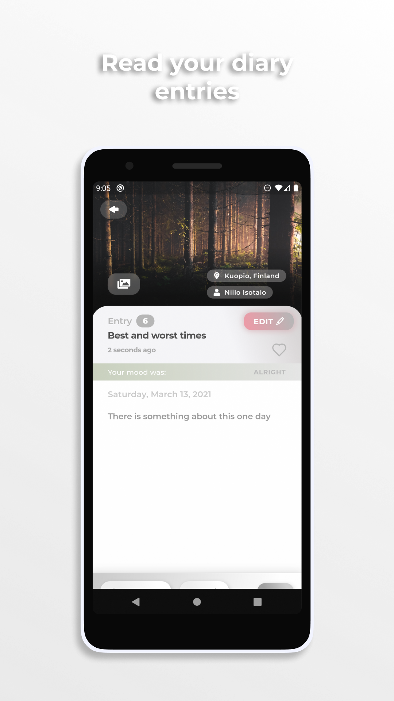
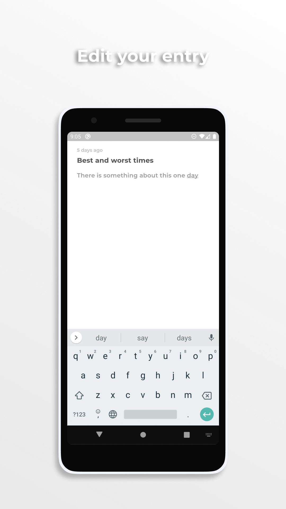
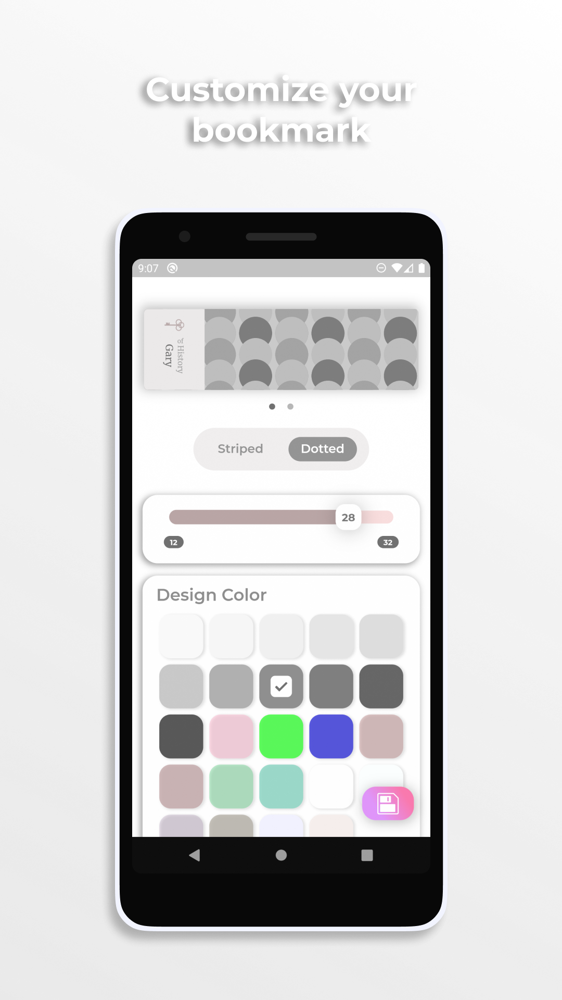

## What is History of Me?

**Your own personal diary**

History of Me wants to be your own personal diary in the digital age. Browse through all of your diary entries and organize your writings. Create, edit and read individual entries and relive your memories. Track your mood and feelings. History of Me offers a digital bookmark you can customize yourself. This app will store your data only on your device. No one else but you will be able to read your diary!

Now available on the Play Store.

<a href='https://play.google.com/store/apps/details?id=com.litlifesoftware.historyofme'></a>

## Trailer

[](https://www.youtube.com/watch?v=58lSSH4YNj0)

## Screenshots

| Browse through your memories                                                                               | Read your diary entries                                                                          |
| ---------------------------------------------------------------------------------------------------------- | ------------------------------------------------------------------------------------------------ |
|  |  |

| Edit your entry                                                                  | Customize your bookmark                                                                          |
| -------------------------------------------------------------------------------- | ------------------------------------------------------------------------------------------------ |
|  |  |

## Getting Started with Flutter

For help getting started with Flutter, view our
[online documentation](https://flutter.dev/docs), which offers tutorials,
samples, guidance on mobile development, and a full API reference.

## Build from Source

To build this app, Flutter should be installed on your computer and should be added to your system path environment variable. Visit the [install guide](https://flutter.io/docs/get-started/install) available on the Flutter website to get started.

Clone the repository and run the app using the Flutter Engine on your local device:

```
git clone https://github.com/litlifesoftware/HistoryOfMe.git
cd HistoryOfMe
flutter run
```

## Signing

In order to create signed APK files to upload to various app stores, you have to specify a keystore location inside the `android\key.properties` file. This file should link to a keystore stored on your local hard drive. Follow [Flutter's deployment guidelines](https://flutter.dev/docs/deployment/android#create-a-keystore) to create your own keystore required to generate verified APK files. Keystores are generated using Java's built-in library. You can generate the JSK files using [Android Studio](https://developer.android.com/studio/publish/app-signing#generate-key). Visit Oracle's Java documentation for a [step-by-step tutorial](https://docs.oracle.com/cd/E19509-01/820-3503/ggfen/index.html).

If you are using Windows and you are working with a working directory on your desktop, your `keystore.properties` file might look similar like this:

```properties
storePassword=YOUR_STORE_PASSWORD
keyPassword=YOUR_KEY_PASSWORD
keyAlias=key
# Set the storeFile path to the current work directory
storeFile=C:\\Users\\Username\\Desktop\\Flutter Working Copy\\Android Keystore\\your_keystore.jks
```

And if you are using Linux-based systems, your `keystore.properties` file might look like this:
```properties
storePassword=YOUR_STORE_PASSWORD
keyPassword=YOUR_KEY_PASSWORD
keyAlias=key
# Set the storeFile path to the current work directory
storeFile=/home/username/Desktop/Flutter\ Working\ Copy/Android\ Keystore/your_keystore.jks
```

Though it's recommended, keep in mind that signing your binaries is not required to run them on your device. You can use the debug build configuration for developing and testing this app. Or you can restore the `build.gradle` file to the default configuration if you don't want to ship signed release binaries.

## Localization

There are **English** and **German** localizations available for this app. These strings are stored in the `assets\json\localized_strings.json` and read on the app's start up.

## Photography Assets

The photographs displayed as 'diary entry backdrop image' are stored on disk and were downloaded from [Unsplash](https://www.unsplash.com/).

Special thanks to the photographers whose photos were used:

**Niilo Isotalo**: "Kuopio, Finland", published `2017-10-16` on [Unsplash](https://unsplash.com/photos/-BZc9Ee1qo0).

**Peiwen Yu**: "Hanzhong, China", published `2017-4-10` on [Unsplash](https://unsplash.com/photos/Etpd8Le6b8E).

**Greg Rakozy**: "Spiral Jetty, United States", published `2015-10-15` on [Unsplash](https://unsplash.com/photos/oMpAz-DN-9I).

Consider checking out their profiles and photos.

## Dependencies

History Of Me uses the following Dart dependencies in order to implement certain
features and functionality:

- [leitmotif](https://pub.dev/packages/leitmotif)
  > A collection of widgets and screens for Flutter implementing the Leitmotif Design Language. [More information](https://www.github.com/litlifesoftware/leitmotif)
- [lit_localization_service](https://pub.dev/packages/lit_localization_service)
  > LitLocalizationService enables you to parse JSON files storing your localization data. [More information](https://www.github.com/litlifesoftware/lit_localization_service)
- [lit_relative_date_time](https://pub.dev/packages/lit_relative_date_time)
  > LitRelativeDateTime enables you to display differences in Time in human-readable format. [More information](https://www.github.com/litlifesoftware/lit_relative_date_time)
- [intl](https://pub.dev/packages/intl) (Used for localization)
- [package_info](https://pub.dev/packages/package_info) (Used to detect the platform)
- [url_launcher](https://pub.dev/packages/url_launcher) (Used to
  redirect users to websites)
- [hive](https://pub.dev/packages/hive) (Used as persistent storage)
- [hive_flutter](https://pub.dev/packages/hive_flutter) (Flutter Addon for Hive)
- [hive_generator](https://pub.dev/packages/hive_generator) (Addon for Hive)
- [build_runner](https://pub.dev/packages/build_runner) (Used to generate Adapter classes for Hive data models)
- [flutter_launcher_icon](https://pub.dev/packages/flutter_launcher_icons) (Used to generate Android/iOS Launcher Icons)

## Status

History of Me is now available on Google Play. Production binaries/APKs are also available on the [Release Section](https://github.com/litlifesoftware/HistoryOfMe/releases). Additional features are coming in next releases.
This app is currently localized in:
- `English`
- `German`

## Pre-Release Setup

While under **History of Me**'s development, the `leitmotif` dependency is likely set to the git repository as source location. The package will be updated rather frequently, so keep in mind to update your Flutter packages if you encounter issues on your local copy by running `flutter pub upgrade`

```yaml
    git: 
      url: https://github.com/litlifesoftware/leitmotif.git
```

## License

Google Play and the Google Play logo are trademarks of Google Inc.

All images in the `assets/images` folder are licensed under the **CC-BY**.

Everything else in this repository including the source code is distributed under the
**BSD 3-Clause** license as specified in the `LICENSE` file.